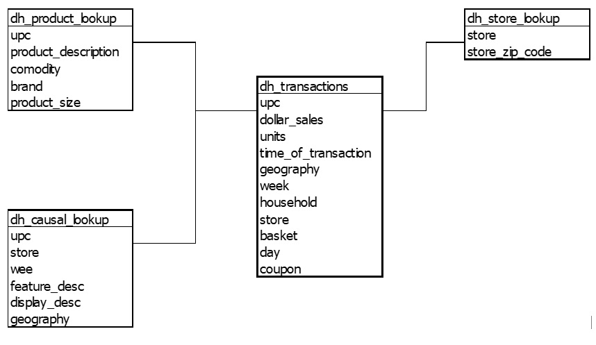

**FOOD RETAIL ANALYSIS**

We investigate the relationships between four products: pasta, pasta
sauce, syrup, and pancake mix. Two years' worth of purchase data are
included in the data set.

The data includes two years' worth of purchase information that has been
matched to consumer and brand information. To enhance sales, we want to
identify a trend in consumer behavior.

The analysis is focused on maximizing sales using coupons. In retail,
coupons are now a crucial tool. By grouping them with already popular
things, they are frequently utilized for promotional activities, for
fostering consumer loyalty, and for boosting sales of a product.

To find Specific period to concentrate on implement promotion (hour, day
of week, and month)

This data has limitation on anonymous datetime then it not clearly
analyst. We assume start date and year to simulation and build new
column of datetime data (in real situation we should ask from data owner
to clarify actual datetime).

Focus points:

  - Units sales

  - Dollar sales

  - Coupon usage

  - Store Geography

  - Store location

  - Product category (commodity)

**PYTHON DATA PREPARATION AND DATA OVERVIEW**

File provided as .csv

Here the relationship between table creates form csv files.

## pleas see more process detail in:  

[document](FOOD-RETAIL-ANALYSIS.docx)  

and  

[jupyter notebook](EDA.ipynb)

Data summary from each feature or variable or dimension (column)

| **Variable**          | **Definition**                                                  | **Values**                                 |
| --------------------- | --------------------------------------------------------------- | ------------------------------------------ |
| basket                | unique identifier of a trip made by a Household to a store      | numeric key                                |
| brand                 | unique name of a Brand to which multiple commodities can belong | character values                           |
| commodity             | unique name of a commodity                                      | pancake mixes, syrups, pasta sauce & pasta |
| coupon                | indicates a coupon was used                                     | 1 = Yes, 0 = No                            |
| day                   | Chronologically ordered identifier for Day of transaction       | numeric, 1 to 728                          |
| display\_desc         | Product location in temporary in-store display                  | character values                           |
| feature\_desc         | Product location on weekly mailer                               | character values                           |
| geography             | identifier for a geography                                      | only two groups, 1 or 2                    |
| household             | unique identifier for a household(customer)                     | numeric key                                |
| store                 | unique identifier for a store                                   | numeric, 1 to 387                          |
| store\_zip\_code      | Zip code of the store                                           | standard zip codes                         |
| time\_of\_transaction | military time of transaction                                    | 4-digit military time                      |
| upc                   | Uniquely identifies a commodity of a brand                      | numeric key                                |
| week                  | Chronologically ordered identifier for a week                   | numeric, 1 to 104                          |

Data visualization and get insight.

ML

Sales and Unit forecast with timeseries. Such as:

  - use fbprophet model

  - ARIMA

 
Tableau public to play with dashboard:

https://public.tableau.com/views/PastaRetail-PromoPlace/PromoPlace?:language=en-US&:display_count=n&:origin=viz_share_link
https://public.tableau.com/app/profile/tanabut.taksinavongskul/viz/PastaUnitsEstimationdifferentperiodoftime/InventoryForcast
https://public.tableau.com/app/profile/tanabut.taksinavongskul/viz/PastaProductSizematter/Product

